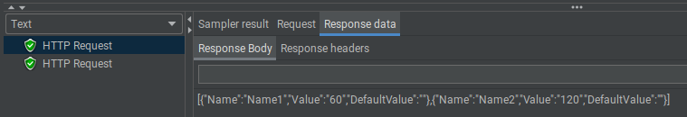

# TestRestService

Базовый REST сервис

значения по-умолчанию передаются через запятую в необязательном path-параметре 
/{defaults}

jmeter/restsvctest.jmx - test suit для jmeter
jmeter/results.xml - результат тестирования сервиса

